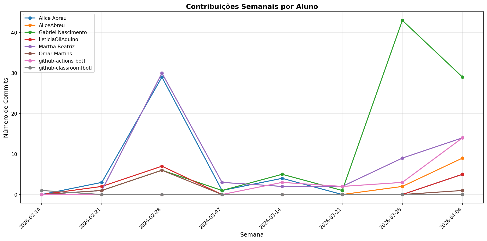

# 📊 Relatório de Contribuições do Projeto

**Última atualização:** 11/04/2026 20:23

---

## 📈 Resumo Geral de Contribuições

| Aluno                 |   Commits |   Linhas+ |   Linhas- |   Arquivos |   Docs Commits |   Docs Arquivos |
|-----------------------|-----------|-----------|-----------|------------|----------------|-----------------|
| Alice Abreu           |        42 |       122 |       120 |          8 |             38 |               8 |
| AliceAbreu            |        11 |      1238 |       707 |         22 |              7 |               4 |
| Gabriel Nascimento    |        86 |      6689 |      1114 |         60 |             34 |               4 |
| LeticiaOliAquino      |        14 |       119 |        43 |          7 |             11 |               3 |
| Martha Beatriz        |        61 |     19901 |     14143 |         29 |             50 |               4 |
| Omar Martins          |         8 |       506 |       149 |          7 |              7 |               2 |
| github-actions[bot]   |        22 |       188 |       182 |          3 |             22 |               1 |
| github-classroom[bot] |         1 |      2152 |         0 |         45 |              1 |              13 |

## 📅 Contribuições Semanais (Todo o Semestre)

**2026-04-04**: Alice Abreu: 5, AliceAbreu: 9, Gabriel Nascimento: 29, LeticiaOliAquino: 5, Martha Beatriz: 14, Omar Martins: 1, github-actions[bot]: 14

**2026-03-28**: AliceAbreu: 2, Gabriel Nascimento: 43, Martha Beatriz: 9, github-actions[bot]: 3

**2026-03-21**: Gabriel Nascimento: 1, Martha Beatriz: 2, github-actions[bot]: 2

**2026-03-14**: Alice Abreu: 4, Gabriel Nascimento: 5, Martha Beatriz: 2, github-actions[bot]: 3

**2026-03-07**: Alice Abreu: 1, Gabriel Nascimento: 1, Martha Beatriz: 3

**2026-02-28**: Alice Abreu: 29, Gabriel Nascimento: 6, LeticiaOliAquino: 7, Martha Beatriz: 30, Omar Martins: 6

**2026-02-21**: Alice Abreu: 3, Gabriel Nascimento: 1, LeticiaOliAquino: 2, Martha Beatriz: 1, Omar Martins: 1

**2026-02-14**: github-classroom[bot]: 1

## 📊 Visualização Gráfica

## ℹ️ Observações

- **Commits**: Número total de commits realizados

- **Linhas+**: Linhas de código adicionadas

- **Linhas-**: Linhas de código removidas

- **Arquivos**: Número de arquivos únicos modificados

- **Docs Commits**: Commits em arquivos de documentação

- **Docs Arquivos**: Arquivos de documentação modificados

---

*Relatório gerado automaticamente via GitHub Actions*
