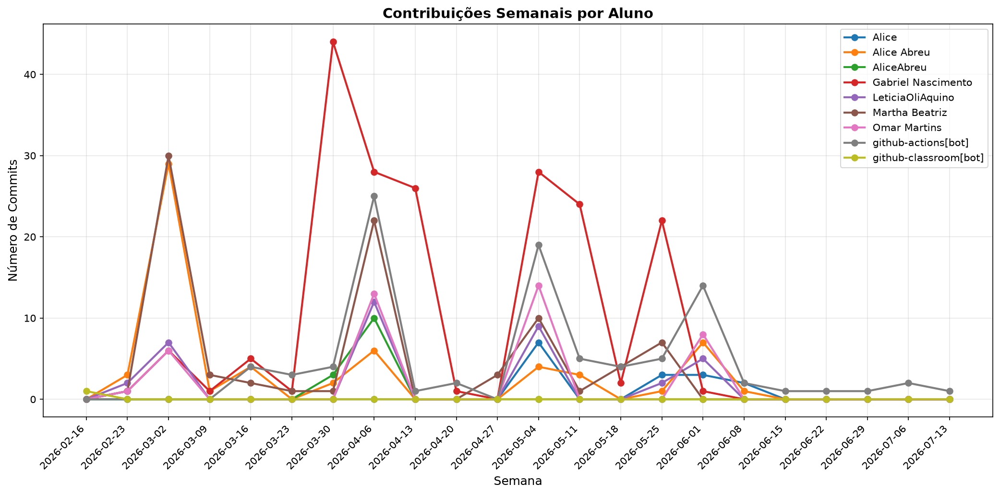

# 📊 Relatório de Contribuições do Projeto

**Última atualização:** 21/09/2026 00:25

---

## 📈 Resumo Geral de Contribuições

| Aluno                 |   Commits |   Linhas+ |   Linhas- |   Arquivos |   Docs Commits |   Docs Arquivos |
|-----------------------|-----------|-----------|-----------|------------|----------------|-----------------|
| Alice                 |        15 |     14914 |       352 |         50 |              9 |              11 |
| Alice Abreu           |        61 |       141 |       142 |         11 |             51 |              11 |
| AliceAbreu            |        13 |      1632 |       772 |         23 |              9 |               4 |
| Gabriel Nascimento    |       190 |     38947 |      6898 |        169 |             60 |               8 |
| LeticiaOliAquino      |        37 |       812 |       301 |         24 |             24 |               9 |
| Martha Beatriz        |        85 |      5661 |      4149 |         56 |             73 |               8 |
| Omar Martins          |        42 |      3581 |      1188 |         78 |             23 |              14 |
| github-actions[bot]   |       102 |       914 |       879 |          3 |            102 |               1 |
| github-classroom[bot] |         1 |      2152 |         0 |         45 |              1 |              13 |

## 📅 Contribuições Semanais (Todo o Semestre)

**2026-09-14**: github-actions[bot]: 1

**2026-09-07**: github-actions[bot]: 1

**2026-08-31**: github-actions[bot]: 1

**2026-08-17**: github-actions[bot]: 1

**2026-08-10**: github-actions[bot]: 1

**2026-08-03**: github-actions[bot]: 2

**2026-07-27**: github-actions[bot]: 1

**2026-07-20**: github-actions[bot]: 1

**2026-07-13**: github-actions[bot]: 1

**2026-07-06**: github-actions[bot]: 1

**2026-06-29**: github-actions[bot]: 1

**2026-06-22**: github-actions[bot]: 1

**2026-06-15**: github-actions[bot]: 1

**2026-06-08**: Alice: 2, Alice Abreu: 1, github-actions[bot]: 2

**2026-06-01**: Alice: 3, Alice Abreu: 7, Gabriel Nascimento: 1, LeticiaOliAquino: 5, Omar Martins: 8, github-actions[bot]: 14

**2026-05-25**: Alice: 3, Alice Abreu: 1, Gabriel Nascimento: 22, LeticiaOliAquino: 2, Martha Beatriz: 7, github-actions[bot]: 5

**2026-05-18**: Gabriel Nascimento: 2, Martha Beatriz: 4, github-actions[bot]: 4

**2026-05-11**: Alice Abreu: 3, Gabriel Nascimento: 24, Martha Beatriz: 1, github-actions[bot]: 5

**2026-05-04**: Alice: 7, Alice Abreu: 4, Gabriel Nascimento: 28, LeticiaOliAquino: 9, Martha Beatriz: 10, Omar Martins: 14, github-actions[bot]: 19

**2026-04-27**: Martha Beatriz: 3, github-actions[bot]: 1

**2026-04-20**: Gabriel Nascimento: 1, github-actions[bot]: 2

**2026-04-13**: Gabriel Nascimento: 26, github-actions[bot]: 1

**2026-04-06**: Alice Abreu: 6, AliceAbreu: 10, Gabriel Nascimento: 28, LeticiaOliAquino: 12, Martha Beatriz: 22, Omar Martins: 13, github-actions[bot]: 25

## 📊 Visualização Gráfica

## ℹ️ Observações

- **Commits**: Número total de commits realizados

- **Linhas+**: Linhas de código adicionadas

- **Linhas-**: Linhas de código removidas

- **Arquivos**: Número de arquivos únicos modificados

- **Docs Commits**: Commits em arquivos de documentação

- **Docs Arquivos**: Arquivos de documentação modificados

---

*Relatório gerado automaticamente via GitHub Actions*
