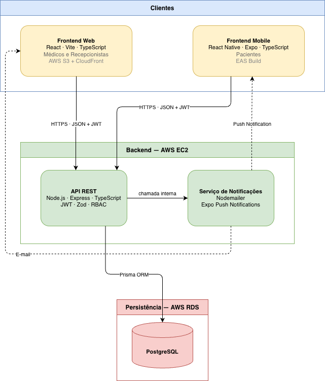

# Introdução

A gestão de agendas médicas é parte fundamental da organização dos serviços de saúde, envolvendo o controle de horários, profissionais e atendimentos em diferentes unidades. Com a informatização desses processos, clínicas e hospitais passaram a utilizar sistemas digitais para realizar o agendamento e o acompanhamento de consultas.

Apesar da adoção de ferramentas tecnológicas, clínicas e hospitais ainda enfrentam desafios relacionados à organização das agendas, como conflitos de horários, falhas no registro de consultas e dificuldade de visualizar a disponibilidade dos profissionais.

Nesse contexto, o desenvolvimento de uma aplicação baseada em uma arquitetura composta por diferentes componentes, como interface de usuário (frontend), backend e banco de dados, permite estruturar de forma eficiente o gerenciamento das informações. A comunicação entre esses componentes ocorre por meio de APIs, possibilitando o acesso e a manipulação dos dados de forma segura e controlada.

A proposta destina-se a profissionais de saúde, equipes administrativas de clínicas e hospitais e pacientes que dependem de processos de agendamento eficientes e integrados.

## Problema

O setor de saúde sofre com uma infraestrutura de dados bastante fragmentada. É comum que os pacientes precisem de acompanhamento com vários especialistas que, por sua vez, atendem em diferentes clínicas, hospitais e consultórios. Atualmente, os sistemas de gestão dessas instituições funcionam de forma isolada; cada local utiliza o seu próprio software de agendamento, que muitas vezes é legado e não se comunica com as ferramentas de outras clínicas.

O problema central deste projeto é justamente a falta de integração e a gestão descentralizada das agendas médicas. Essa desconexão entre os sistemas gera ineficiências graves no dia a dia.

Para os pacientes, marcar consultas é um processo demorado e ineficiente. Eles precisam entrar em contato individualmente com cada clínica, seja por telefone, WhatsApp ou sites diferentes, apenas para tentar conciliar um horário disponível com o médico que procuram.

Para os profissionais de saúde que dividem seu tempo entre vários locais, esse isolamento dos sistemas prejudica o controle da própria agenda. O grande obstáculo é o desperdício de horários vagos. Por exemplo: se um paciente cancela uma consulta na Clínica A, essa janela de tempo fica ociosa. Como não há uma visão unificada da agenda global do médico, a Clínica B não tem como saber que aquele horário vagou para oferecê-lo rapidamente a outro paciente.

No fim das contas, a falta de sincronização entre os diferentes pontos de atendimento gera informações desatualizadas, desperdiça o tempo útil dos médicos e dificulta o acesso rápido dos pacientes aos serviços de saúde.

## Objetivos

Desenvolver um sistema de agenda médica online que permita aos pacientes visualizar horários disponíveis e agendar consultas, enquanto médicos podem cadastrar serviços e disponibilizar seus horários de atendimento.

### Objetivos específicos

- Desenvolver uma aplicação web para que pacientes e médicos possam acessar o sistema.

- Permitir o cadastro e gerenciamento de médicos na plataforma.

- Permitir que médicos cadastrem os serviços oferecidos.

- Permitir que médicos disponibilizem horários para atendimento.

- Permitir que pacientes visualizem horários disponíveis e realizem agendamentos de consultas.

- Armazenar e gerenciar as informações do sistema em um banco de dados.

- Desenvolver uma API para comunicação entre a aplicação web e o banco de dados.

## Justificativa

A gestão de agendas médicas no Brasil enfrenta sérios desafios de interoperabilidade e sincronização entre diferentes clínicas, hospitais e consultórios. Segundo levantamento da Associação Nacional de Hospitais Privados (ANAHP), cerca de 42% das instituições privadas relatam dificuldades recorrentes na confirmação de consultas, o que gera perdas financeiras que podem ultrapassar R$ 140 mil anuais por clínica, em decorrência de horários vagos e cancelamentos não gerenciados (ANAHP, 2022).

No âmbito público, dados do Ministério da Saúde indicam que, em 2023, 3 em cada 10 pacientes faltaram a consultas ou exames sem realizar desmarcação prévia, comprometendo diretamente a eficiência do Sistema Único de Saúde (SUS) (Ministério da Saúde, 2023).

Além disso, plataformas de reclamação como o Reclame Aqui evidenciam a insatisfação dos pacientes em relação aos processos de agendamento. As queixas mais frequentes incluem dificuldade de contato com clínicas, demora nas respostas via canais digitais, como WhatsApp, e ausência de integração entre sistemas de atendimento (RECLAME AQUI, 2023).

Diante desse cenário, a implementação de um sistema distribuído de agenda médica não atende exclusivamente às demandas técnicas de interoperabilidade, escalabilidade e segurança, como também se configura como uma solução estratégica para reduzir perdas financeiras, melhorar a experiência do paciente e aumentar a eficiência operacional do setor de saúde no Brasil.

Fontes disponíveis em: [Referências](./referencia.md)

## Público-Alvo

- **Profissionais da área de saúde**: Os profissionais de saúde possuem experiência prévia com sistemas de prontuário eletrônico e plataformas de gestão hospitalar. Para esses, o impacto é a unificação da vida profissional. Estão habituados ao uso de ferramentas digitais no cotidiano, mas enfrentam dificuldades ao conciliar agendas em diferentes instituições, pois muitos dividem o dia entre consultórios próprios, hospitais e clínicas de terceiros. Por isso, precisam de uma solução integrada que facilite o gerenciamento de compromissos, evitando assim o estresse de conflitos de horários, diminuindo também o problema do tempo ocioso pela desmarcação de consultas em cima da hora.

- **Corpo administrativo**: O corpo administrativo possui experiência com sistemas de agendamento e gestão de pacientes, mas muitas vezes em plataformas pouco integradas. Necessitam de uma ferramenta que simplifique os processos, reduza falhas e a carga de trabalho manual, apoie diretamente na organização das agendas dos profissionais de saúde.

- **Pacientes**: O grupo dos pacientes é composto por um espectro diverso que vai desde jovens e adultos com alta familiaridade digital, que buscam resolver tudo pelo smartphone com poucos cliques, até idosos com menor domínio tecnológico, que podem se sentir intimidados por interfaces complexas e que também podem enfrentar dificuldades no processo de agendamento e verificação de consultas. Em comum, todos necessitam de uma solução que proporcione praticidade, rapidez e simplicidade.

# Especificações do Projeto

## Requisitos

Nesta seção são apresentados os requisitos funcionais e não funcionais do sistema, responsáveis por definir as funcionalidades e as características necessárias para o funcionamento da solução proposta, MedHub. Os requisitos foram identificados a partir da análise do problema e das necessidades dos usuários do sistema. Para organizar sua implementação, foi aplicada uma técnica de priorização de requisitos, permitindo classificar cada requisito de acordo com seu nível de importância para o desenvolvimento do projeto.

### Requisitos Funcionais

| ID | Descrição do Requisito | Prioridade | Responsável |
|--------|--------------------------------------------------------------------------------------------------------------------------------------------------------------------------|------------|-------------|
| RF-001 | O sistema deve permitir que os pacientes agendem, visualizem e cancelem consultas médicas pelo aplicativo. | ALTA | |
| RF-002 | O sistema deve permitir que médicos e recepcionistas gerenciem a agenda de marcações através da interface web. | ALTA | |
| RF-003 | O sistema deve armazenar todas as informações de consultas em uma base de dados centralizada, compartilhada entre as aplicações web e móvel. | ALTA | |
| RF-004 | O sistema deve permitir o cadastro e o login de todos os usuários (pacientes, médicos e recepcionistas), garantindo um único cadastro por CPF e por e-mail. | ALTA | |
| RF-005 | O sistema deve notificar os usuários sobre confirmações e cancelamentos de consultas. | MÉDIA | |
| RF-006 | O sistema deve permitir o cadastro e o gerenciamento de clínicas como entidades independentes na plataforma, cada uma com seus próprios médicos e horários disponíveis. | ALTA | |
| RF-007 | O sistema deve impedir o agendamento de consultas sem que o perfil do usuário esteja devidamente cadastrado e validado. | ALTA | |
| RF-008 | O sistema deve impedir o agendamento de mais de uma consulta para o mesmo médico no mesmo horário. | ALTA | |

### Requisitos não Funcionais

| ID      | Descrição do Requisito                                                                                                                                      | Prioridade | 
| ------- | ----------------------------------------------------------------------------------------------------------------------------------------------------------- | ---------- |
| RNF-001 | A comunicação entre as aplicações (web e mobile) e o servidor deve ser padronizada por meio de uma API REST.                                                | ALTA       |
| RNF-002 | O sistema deve possuir tempo de resposta até 3 segundos para pesquisas e ações na agenda.                                                                   | MÉDIA      |
| RNF-003 | A interface web deve ser responsiva para se adaptar e funcionar corretamente em diferentes tamanhos de tela.                                                | ALTA       |
| RNF-004 | O aplicativo móvel deve ser compatível com as plataformas Android e iOS.                                                                                    | ALTA       |
| RNF-005 | O sistema deve utilizar tokens JWT para garantir a autenticação e autorização segura em todas as requisições entre as aplicações e a API.                   | ALTA       |
| RNF-006 | O sistema deve ser compatível com as versões mais recentes dos principais navegadores do mercado (Google Chrome, Mozilla Firefox, Safari e Microsoft Edge). | ALTA       |

## Restrições

O projeto está restrito pelas condições e limitações apresentadas na tabela a seguir:

| ID  | Restrição                                                                                                                                 |
| --- | ----------------------------------------------------------------------------------------------------------------------------------------- |
| 01  | O projeto deverá ser entregue dentro do prazo estabelecido até o final do semestre letivo.                                                |
| 02  | O projeto deve ser desenvolvido exclusivamente com ferramentas e softwares gratuitos ou de código aberto, sem fomento financeiro externo. |

# Catálogo de Serviços - MedHub

Os serviços de Tecnologia da Informação do MedHub foram pensados para apoiar diretamente os objetivos estratégicos da organização. A TI atua como uma parceira do negócio, oferecendo suporte e soluções que facilitam o acesso e o uso adequado dos recursos tecnológicos.

A seguir, apresentamos os serviços de TI disponibilizados pelo MedHub e como eles podem apoiar as atividades dos usuários.

## Visão Geral

A tabela a seguir apresenta um resumo de todos os serviços disponíveis no portfólio de TI do MedHub:

| ID  | Serviço                                | Categoria             | Público-alvo                       |
| --- | -------------------------------------- | --------------------- | ---------------------------------- |
| S01 | Agendamento de Consulta                | Serviço de Negócio    | Pacientes e corpo administrativo   |
| S02 | Consulta de Agenda Médica              | Serviço de Informação | Pacientes e profissionais de saúde |
| S03 | Cancelamento e Remarcação de Consultas | Serviço de Negócio    | Pacientes e corpo administrativo   |
| S04 | Notificações e Alertas de Consulta     | Serviço de Suporte    | Todos os usuários                  |
| S05 | Autenticação de Usuário (Login)        | Serviço de TI         | Todos os usuários                  |
| S06 | Recuperação de Senha                   | Serviço de TI         | Todos os usuários                  |

## Descrição Detalhada

### S01 - Agendamento de Consulta

| Campo               | Detalhe                                                                                                                                              |
| ------------------- | ---------------------------------------------------------------------------------------------------------------------------------------------------- |
| **Categoria**       | Serviço de Negócio                                                                                                                                   |
| **Tipo**            | Autoatendimento                                                                                                                                      |
| **Descrição**       | Permite que pacientes agendem consultas médicas diretamente pelo aplicativo MedHub, com seleção de profissional, especialidade e horário disponível. |
| **Funcionalidades** | ▸ Busca de profissionais por especialidade e disponibilidade   ▸ Seleção de data e horário                                                     |
| **Público-alvo**    | Pacientes e corpo administrativo                                                                                                                     |
| **Acesso**          | Menu principal → Agendar Consulta                                                                                                                    |
| **Disponibilidade** | Contínua via aplicativo (24/7)                                                                                                                       |

---

### S02 - Consulta de Agenda Médica

| Campo               | Detalhe                                                                                                                             |
| ------------------- | ----------------------------------------------------------------------------------------------------------------------------------- |
| **Categoria**       | Serviço de Informação                                                                                                               |
| **Tipo**            | Autoatendimento                                                                                                                     |
| **Descrição**       | Permite que pacientes e profissionais de saúde visualizem, de forma centralizada, as consultas agendadas e os horários disponíveis. |
| **Funcionalidades** | ▸ Visualização da agenda pessoal do paciente   ▸ Consulta de disponibilidade de profissionais de saúde                        |
| **Público-alvo**    | Pacientes e profissionais de saúde                                                                                                  |
| **Acesso**          | Menu → Minhas Consultas                                                                                                             |
| **Disponibilidade** | Contínua via aplicativo (24/7)                                                                                                      |

---

### S03 - Cancelamento e Remarcação de Consultas

| Campo               | Detalhe                                                                                                                           |
| ------------------- | --------------------------------------------------------------------------------------------------------------------------------- |
| **Categoria**       | Serviço de Negócio                                                                                                                |
| **Tipo**            | Autoatendimento                                                                                                                   |
| **Descrição**       | Permite que pacientes e o corpo administrativo cancelem ou remarquem consultas previamente agendadas diretamente pelo aplicativo. |
| **Funcionalidades** | ▸ Cancelamento de consulta com registro de motivo   ▸ Remarcação para nova data e horário disponível                        |
| **Público-alvo**    | Pacientes e corpo administrativo                                                                                                  |
| **Acesso**          | Menu → Minhas Consultas → Alterar/Cancelar                                                                                        |
| **Disponibilidade** | Contínua via aplicativo (24/7)                                                                                                    |

---

### S04 - Notificações de Consulta

| Campo               | Detalhe                                                                                                                      |
| ------------------- | ---------------------------------------------------------------------------------------------------------------------------- |
| **Categoria**       | Serviço de Suporte                                                                                                           |
| **Tipo**            | Automático                                                                                                                   |
| **Descrição**       | Serviço de comunicação automática que envia notificações aos usuários sobre criação, alteração ou cancelamento de consultas. |
| **Funcionalidades** | ▸ Notificação ao confirmar, alterar ou cancelar consulta                                                                  |
| **Público-alvo**    | Todos os usuários do aplicativo                                                                                              |
| **Acesso**          | Ativado automaticamente em Configurações → Notificações                                                                      |
| **Disponibilidade** | Contínua via aplicativo (24/7)                                                                                               |

---

### S05 - Autenticação de Usuário (Login)

| Campo               | Detalhe                                                                                          |
| ------------------- | ------------------------------------------------------------------------------------------------ |
| **Categoria**       | Serviço de TI                                                                                    |
| **Tipo**            | Infraestrutura / Segurança                                                                       |
| **Descrição**       | Controla o acesso ao sistema MedHub por meio de autenticação segura com credenciais cadastradas. |
| **Funcionalidades** | ▸ Login com e-mail e senha cadastrados                                                        |
| **Público-alvo**    | Todos os usuários                                                                                |
| **Acesso**          | Tela inicial do aplicativo MedHub → Login                                                        |
| **Disponibilidade** | Contínua via aplicativo (24/7)                                                                   |

---

### S06 - Recuperação de Senha

| Campo               | Detalhe                                                                                                                                                                      |
| ------------------- | ---------------------------------------------------------------------------------------------------------------------------------------------------------------------------- |
| **Categoria**       | Serviço de TI                                                                                                                                                                |
| **Tipo**            | Autoatendimento/Segurança                                                                                                                                                    |
| **Descrição**       | Permite que usuários que esqueceram sua senha redefinem o acesso à conta.                                                                                                    |
| **Funcionalidades** | ▸ Envio de link de redefinição para o e-mail cadastrado   ▸ Verificação de identidade antes da redefinição   ▸ Confirmação de redefinição bem-sucedida por notificação |
| **Público-alvo**    | Todos os usuários                                                                                                                                                            |
| **Acesso**          | Tela de Login → Esqueci minha senha                                                                                                                                          |
| **Disponibilidade** | Contínua via aplicativo (24/7)                                                                                                                                               |

---

## Glossário

| Termo                  | Definição                                                                                                       |
| ---------------------- | --------------------------------------------------------------------------------------------------------------- |
| **Serviço de Negócio** | Serviço que apoia diretamente as atividades da organização, com impacto direto na experiência do usuário final. |
| **Serviço de TI**      | Serviço técnico que sustenta a infraestrutura e a segurança da plataforma.                                      |
| **Serviço de Suporte** | Serviço auxiliar que garante o funcionamento e a usabilidade dos demais serviços.                               |
| **Disponibilidade**    | Tempo em que o serviço está operacional e acessível aos usuários.                                               |

# Arquitetura da Solução

O MedHub é um **sistema distribuído** estruturado em uma arquitetura cliente-servidor de três camadas, onde cada camada opera de forma autônoma em infraestrutura própria e a comunicação entre os componentes ocorre exclusivamente por meio de rede, sem memória ou estado compartilhado entre eles.

Essa separação garante que cada componente possa ser implantado, escalado e atualizado de forma independente, sem impactar os demais, característica fundamental de sistemas distribuídos segundo Tanenbaum & Van Steen.

As camadas que compõem o sistema são:

- **Frontend Web**: aplicação React executada no navegador do usuário, voltada a médicos e recepcionistas. Não possui acesso direto ao banco de dados; toda comunicação passa pela API.
- **Frontend Mobile**: aplicativo React Native (Expo) voltado principalmente aos pacientes. Igualmente desacoplado do backend, comunica-se apenas via API REST.
- **Backend (API REST)**: servidor Node.js responsável pela lógica de negócio, autenticação e orquestração do acesso aos dados. É o único ponto de entrada para o banco de dados.
- **Banco de Dados**: instância PostgreSQL acessada exclusivamente pelo backend via Prisma ORM.

Todos os componentes são escritos em **TypeScript**. A comunicação entre clientes e backend utiliza **HTTPS + REST**, com autenticação **stateless via JWT**.

## Tecnologias Utilizadas

| Camada          | Tecnologias                                                              |
| --------------- | ------------------------------------------------------------------------ |
| Backend         | Node.js · Express.js · TypeScript · Prisma ORM · JWT · Zod · Nodemailer  |
| Banco de dados  | PostgreSQL                                                               |
| Frontend Web    | React · Vite · TypeScript · React Router · Axios · Tailwind CSS          |
| Frontend Mobile | React Native · Expo · TypeScript · Expo Router · Expo Push Notifications |

## Hospedagem

A plataforma será hospedada na **Amazon Web Services (AWS)**. A arquitetura contempla dois ambientes distintos:

- **Desenvolvimento**: executado localmente com Docker Compose, subindo instâncias locais do PostgreSQL e da API para agilizar o ciclo de desenvolvimento e testes.
- **Produção**: cada componente é implantado em um serviço AWS dedicado, conforme a tabela abaixo.

| Componente                  | Serviço AWS                     | Justificativa                                                                                                                            |
| --------------------------- | ------------------------------- | ---------------------------------------------------------------------------------------------------------------------------------------- |
| Backend (API Node.js)       | AWS EC2                         | Instância para execução do servidor Node.js, permitindo configuração direta do ambiente, variáveis e regras de rede via Security Groups. |
| Banco de dados (PostgreSQL) | AWS RDS (PostgreSQL)            | Banco de dados relacional gerenciado, isolado do servidor de aplicação, reforçando a separação de camadas da arquitetura distribuída.    |
| Frontend Web (React/Vite)   | AWS S3 + CloudFront             | O build estático da SPA é hospedado no S3 e distribuído via CloudFront, sem necessidade de servidor dedicado para o frontend.            |
| Frontend Mobile (Expo)      | Expo Application Services (EAS) | Build e geração dos pacotes para Android (APK/AAB) e iOS (IPA), com distribuição via Google Play e App Store em produção.                |
