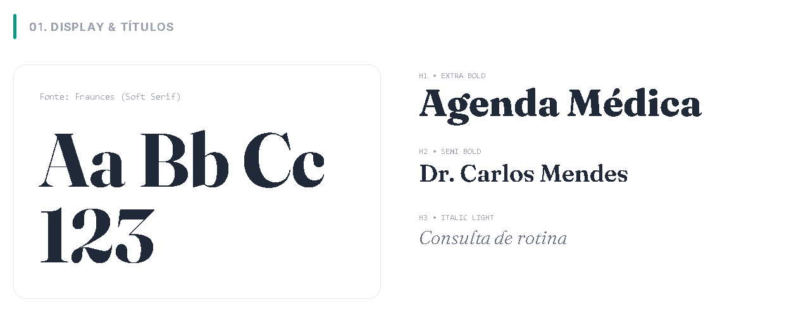
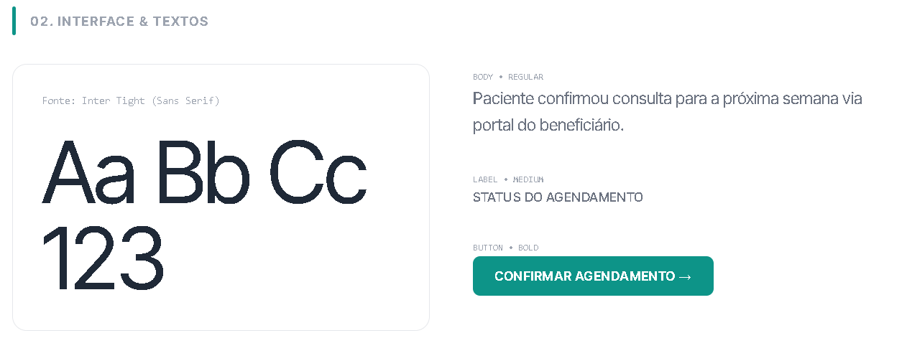
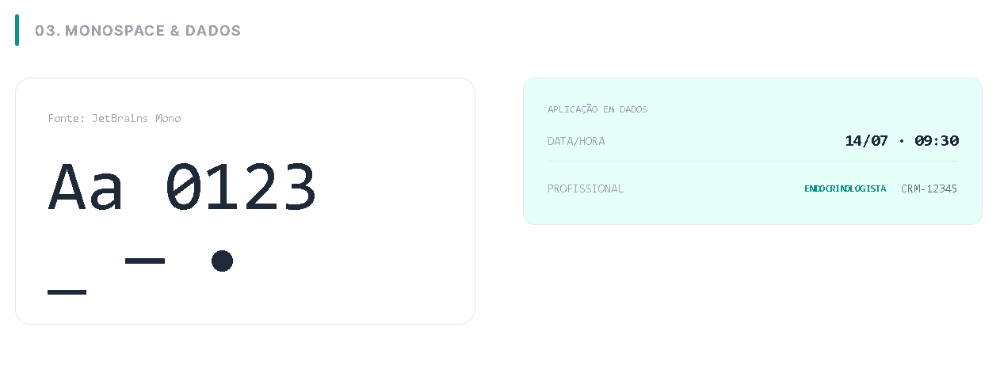
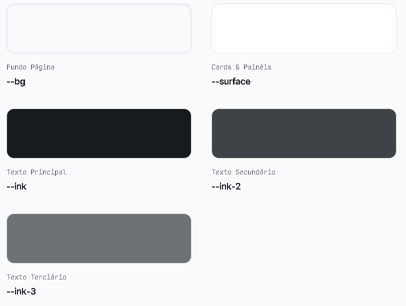
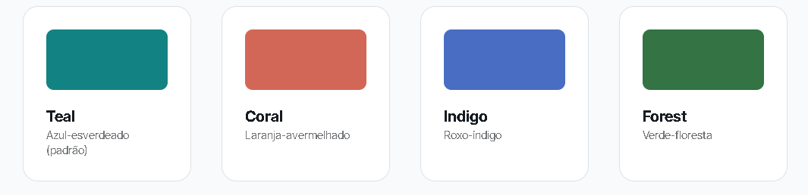
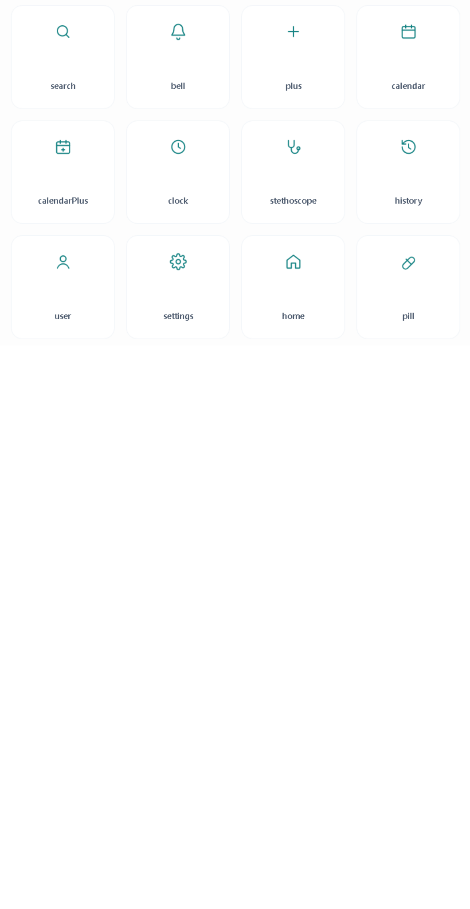
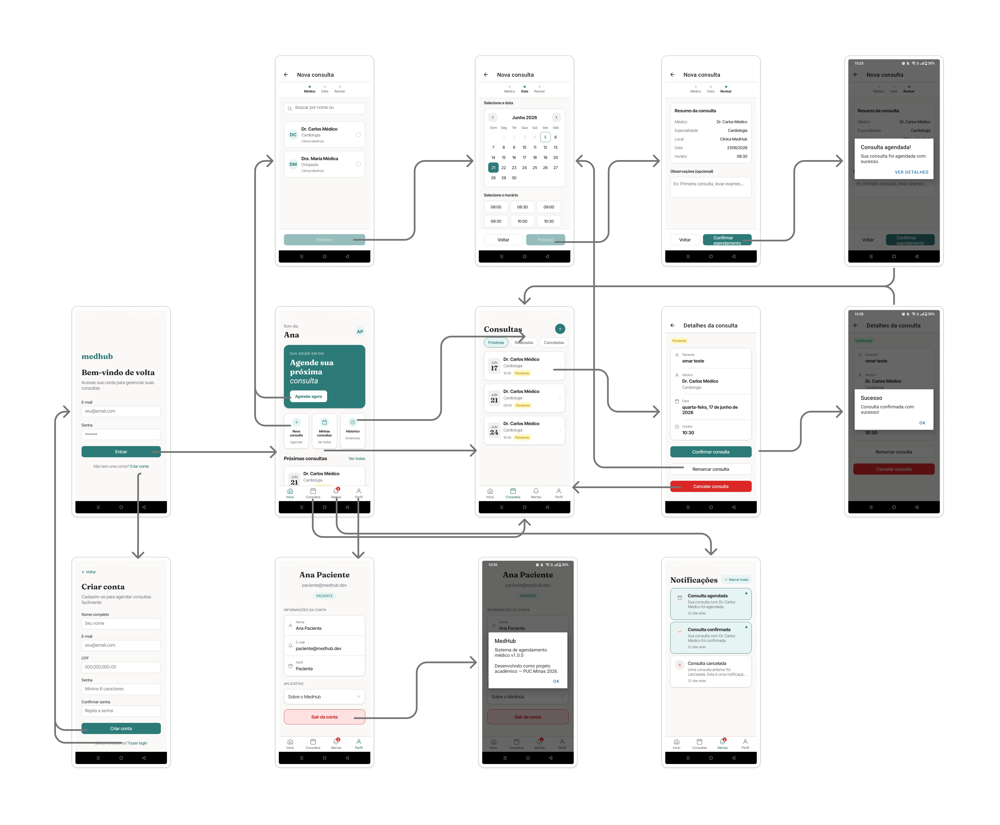

# Front-end Móvel

O aplicativo móvel do MedHub foi desenvolvido para oferecer aos pacientes uma experiência simples e eficiente no gerenciamento de consultas médicas. Por meio do app, os usuários podem agendar novas consultas, acompanhar as próximas e as realizadas, cancelar agendamentos e receber notificações em tempo real sobre alterações em suas consultas.

---

## Projeto da Interface

A interface foi construída como um aplicativo React Native com roteamento baseado em arquivos (Expo Router). A navegação principal é organizada em quatro abas (Início, Consultas, Notificações e Perfil), com uma pilha de telas adicionais para ações específicas — como agendamento e detalhes de consulta.

### Wireframes

Os wireframes foram produzidos em alta fidelidade e cobrem as principais telas do aplicativo, organizados para refletir o fluxo real de uso: autenticação, agendamento, acompanhamento de consultas e notificações.

Os wireframes completos podem ser visualizados em: [Wireframes MedHub](img/medbub-wireframes-mobile.pdf).

---

### Design Visual

A identidade visual do MedHub Mobile é uma extensão direta do sistema de design do MedHub Web, garantindo consistência visual entre as duas plataformas. No contexto mobile, o sistema tipográfico tri-modular é equilibrado para telas menores, priorizando legibilidade em diferentes dispositivos, enquanto mantém a hierarquia visual que reduz a carga cognitiva dos usuários.

A experiência do usuário mobile é guiada pelo uso estratégico do tom Teal como principal sinalizador de ação, adaptado para interações por toque e feedbacks visuais responsivos. O sistema é validado por princípios de acessibilidade e legibilidade, utilizando tokens de cor OKLCH para garantir uma percepção visual uniforme e inclusiva em toda a jornada de uso.

#### Relação entre o design web e mobile

O MedHub Web e Mobile compartilham o mesmo sistema de design base. Os tokens de estilo do mobile (`src/mobile/lib/tokens.ts`) foram definidos como um espelho direto das variáveis CSS do web (`src/web/src/styles/globals.css`), garantindo que cores, tipografia e espaçamentos sigam as mesmas diretrizes visuais nas duas plataformas. A única diferença técnica nas cores é o formato: no web, são declaradas em OKLCH para percepção uniforme. No mobile, são pré-convertidas para hex, pois o React Native não suporta esse formato nativamente.

**Diferenças por necessidade de plataforma**

Fontes, paleta de cores e hierarquia visual são idênticas nas duas versões. As diferenças a seguir existem exclusivamente por limitações ou convenções de cada plataforma:

| Aspecto                  | Web                                          | Mobile                                |
| ------------------------ | -------------------------------------------- | ------------------------------------- |
| Navegação principal      | Sidebar fixa (244px) + header (64px)         | Bottom tab bar (60px)                 |
| Responsividade           | Media queries (`max-width: 1000px`, `520px`) | `SafeAreaView` + flexbox nativo       |
| Tamanho de fonte base    | 14px                                         | 15px (`typography.size.base`)         |
| Variantes de accent      | Teal, Coral, Indigo, Forest                  | Apenas Teal                           |
| Adaptação ao dispositivo | CSS Grid + breakpoints                       | Flexbox com dimensões fixas em tokens |

**Tipografia**

A fonte Fraunces foi selecionada para a hierarquia principal (H1, H2 e H3) por ser uma Soft Serif que equilibra autoridade clínica com um tom acolhedor, estabelecendo uma hierarquia semântica clara que organiza e facilita a busca e extração de informações.



A Inter Tight atua como a base funcional da aplicação, sendo utilizada em corpos de texto, labels e botões para garantir máxima legibilidade. A estrutura sans-serif proporciona uma interface limpa e padronizada, assegurando clareza visual em qualquer dispositivo ou resolução.



Por último, a fonte JetBrains Mono aplica o princípio da diferenciação visual, permitindo que o cérebro identifique instantaneamente a transição entre conteúdos explicativos e dados brutos.



**Paleta de cores**

O sistema usa tokens OKLCH para garantir perceptibilidade uniforme entre tons. No aplicativo React Native, essas cores são aplicadas diretamente aos componentes e estilos da interface; este documento não descreve suporte a alternância de tema via `data-theme` ou elemento `<html>`.

***Cores Principais***



***Cores Destaque***



**Ícones**

Todos os ícones são SVG inline, definidos em `src/mobile/components/ui/Icon.tsx` (importado como `@/components/ui/Icon`). Não há dependência de biblioteca de ícones externa.



---

## Fluxo de Dados

O fluxo de dados mapeia a navegação do usuário através das diferentes interfaces do aplicativo MedHub, ilustrando como as interações levam de uma tela para outra.



**Pontos-chave da Navegação:**
- **Autenticação (`/auth/login`)**: Porta de entrada do aplicativo que redireciona para a interface principal após login bem-sucedido.
- **Tela Inicial (`/(tabs)/index`)**: Painel principal (Início) que exibe o hero card, as próximas consultas e atalhos rápidos.
- **Navegação Principal (`Tabs`)**: Controla o acesso às principais seções do aplicativo: Início, Consultas, Notificações e Perfil.
- **Gestão de Agendamentos (`/appointment/...`)**: Telas em pilha (stack) dedicadas à criação de novas consultas e visualização de detalhes de agendamentos.


---

## Tecnologias Utilizadas

| Tecnologia                     | Versão  | Função                                                |
| ------------------------------ | ------- | ----------------------------------------------------- |
| React Native                   | 0.76.x  | Framework base para apps iOS e Android                |
| Expo SDK                       | ~52.0.x | Toolchain, device APIs e serviços de build            |
| Expo Router                    | ~4.0.x  | Roteamento baseado em arquivos (file-based routing)   |
| TypeScript                     | ^5.3    | Tipagem estática em todo o projeto                    |
| expo-google-fonts              | ^0.2.x  | Carregamento das fontes Fraunces e Inter Tight        |
| react-native-svg               | 15.8.x  | Renderização de ícones SVG inline                     |
| expo-secure-store              | ~14.0.x | Armazenamento seguro do token JWT (Keychain/Keystore) |
| expo-notifications             | ~0.29.x | Notificações push via Expo Push Service               |
| react-native-safe-area-context | 4.12.x  | Adaptação a notch e home indicator                    |
| react-native-gesture-handler   | ~2.20.x | Gestos e interações nativas                           |
| react-native-screens           | ~4.4.x  | Otimização de telas nativas para o navigator          |

---

## Considerações de Segurança

- **Armazenamento do token:** O token JWT é armazenado com `expo-secure-store`, que utiliza o iOS Keychain e o Android Keystore — mecanismos de segurança nativos do sistema operacional, criptografados e isolados por app.
- **Cabeçalho de autorização:** Todas as chamadas autenticadas incluem `Authorization: Bearer <token>` via a função `authHeaders()` em `lib/api.ts`.
- **Proteção de rotas:** O componente `AuthGuard` no `app/_layout.tsx` monitora o estado de autenticação e redireciona automaticamente usuários não autenticados para a tela de login, impedindo o acesso a qualquer tela protegida.
- **Validação de formulários:** Os formulários de login e cadastro validam campos no lado do cliente antes de chamar a API, com mensagens de erro em português.
- **Push Notifications:** Falhas no registro do token push são ignoradas silenciosamente para não bloquear o fluxo de autenticação.
- **Papel fixo:** O aplicativo móvel registra usuários exclusivamente com o papel `PATIENT`, impedindo que o formulário de cadastro do app seja usado para criar contas administrativas.

---

## Implantação

### Pré-requisitos

| Ferramenta    | Versão mínima | Como verificar                        |
| ------------- | ------------- | ------------------------------------- |
| Node.js       | 22.x LTS      | `node -v`                             |
| npm           | 9+            | `npm -v`                              |
| Expo CLI      | —             | `npx expo --version`                  |
| Expo Go (app) | —             | Disponível na App Store / Google Play |

### 1. Instalar dependências

```bash
cd src/mobile
npm install
```

### 2. Iniciar o mock server (backend de desenvolvimento)

O aplicativo se comunica com o mock server do frontend web durante o desenvolvimento:

```bash
cd src/web/mock-server
node server.js
# Servidor disponível em http://localhost:3000
```

> **Android Emulator:** A URL base é automaticamente ajustada para `http://10.0.2.2:3000`, que aponta para o host da máquina de dentro do emulador.

### 3. Iniciar o aplicativo

```bash
cd src/mobile
npx expo start
```

Escaneie o QR Code com o **Expo Go** (iOS ou Android) ou pressione:
- `i` para abrir no simulador iOS
- `a` para abrir no emulador Android

### Produção

O build e distribuição para Android (APK/AAB) e iOS (IPA) são gerenciados pelo **Expo Application Services (EAS)**:

```bash
# Build para Android
eas build --platform android

# Build para iOS
eas build --platform ios
```

---

## Testes

### Checklist de testes manuais

- [ ] Login com credenciais válidas redireciona para o dashboard
- [ ] Tentativa de login com senha errada exibe mensagem de erro
- [ ] Cadastro de novo paciente com CPF e e-mail únicos funciona
- [ ] Tentativa de cadastro com CPF inválido (< 11 dígitos) exibe erro
- [ ] Dashboard exibe saudação correta (bom dia/tarde/noite) e próximas consultas
- [ ] Tela de Consultas lista todas com status correto (chips coloridos)
- [ ] Filtros de Consultas (Próximas / Realizadas / Canceladas) funcionam corretamente
- [ ] Tap em uma consulta abre a tela de detalhes com todas as informações
- [ ] Cancelar consulta exibe diálogo de confirmação e atualiza o status
- [ ] Agendamento: seleção de médico → data → horário → confirmação cria nova consulta
- [ ] Consulta recém-criada aparece na lista e no dashboard
- [ ] Tela de Notificações exibe o feed com indicador de não lidas
- [ ] Tap em notificação não lida a marca como lida (ponto some)
- [ ] Botão "Marcar todas" remove todos os pontos de não lidas
- [ ] Badge de notificações no tab bar reflete o número correto de não lidas
- [ ] Tela de Perfil exibe nome, e-mail e papel do usuário
- [ ] Logout exibe diálogo de confirmação e redireciona para login
- [ ] App restaura sessão após fechar e reabrir (token persistido)

### Cenários de teste documentados

| Funcionalidade | Documento de testes |
| --- | --- |
| Agendar, visualizar e cancelar consultas (RF-001) | [Cenários de Teste — Agendamento Mobile](rf-001-appointments/cenarios-de-teste-mobile.md) |
| Gestão de Agendamentos (RF-002) | [Cenários de Teste — Gestão Mobile](rf-002-appointments-management/cenarios-de-teste-mobile.md) |
| Controle de acesso a consultas (RF-003) | [Cenários de Teste — Segurança Mobile](rf-003-appointments-security/cenarios-de-teste-mobile.md) |
| Prevenção de conflito de horários (RF-004) | [Cenários de Teste — Concorrência Mobile](rf-004-appointments-concurrency/cenarios-de-teste-mobile.md) |
| Login e cadastro de paciente (RF-005) | [Cenários de Teste — Login e Cadastro](rf-005-auth/cenarios-de-teste-mobile.md) |
| Notificações push e in-app (RF-006) | [Cenários de Teste — Notificações Mobile](rf-006-notifications/cenarios-de-teste-mobile.md) |

---

# Referências

- [Expo SDK 52 — Documentação oficial](https://docs.expo.dev)
- [Expo Router v4 — Documentação oficial](https://expo.github.io/router/docs)
- [expo-secure-store](https://docs.expo.dev/versions/latest/sdk/securestore/)
- [expo-notifications](https://docs.expo.dev/versions/latest/sdk/notifications/)
- [react-native-svg](https://github.com/software-mansion/react-native-svg)
- [Fraunces — Google Fonts](https://fonts.google.com/specimen/Fraunces)
- [Inter Tight — Google Fonts](https://fonts.google.com/specimen/Inter+Tight)
- `docs/backend-apis.md` — especificação das rotas da API do backend MedHub
- `docs/contexto.md` — requisitos e contexto do projeto (ETAPA 1)
- `docs/frontend-web.md` — documentação do frontend web (ETAPA 3)
