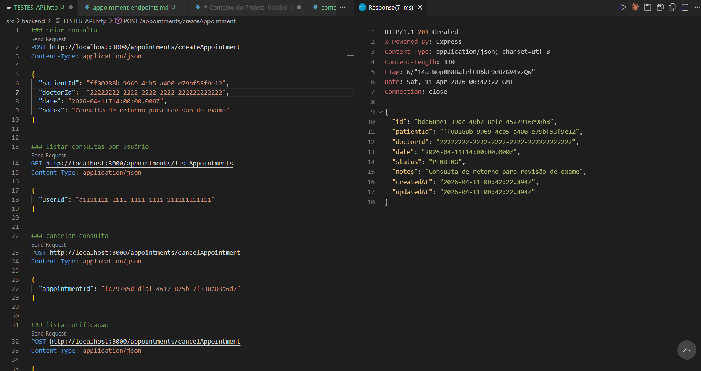
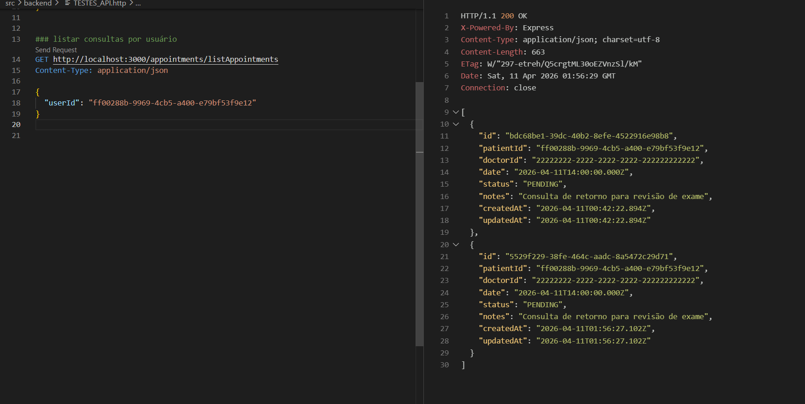
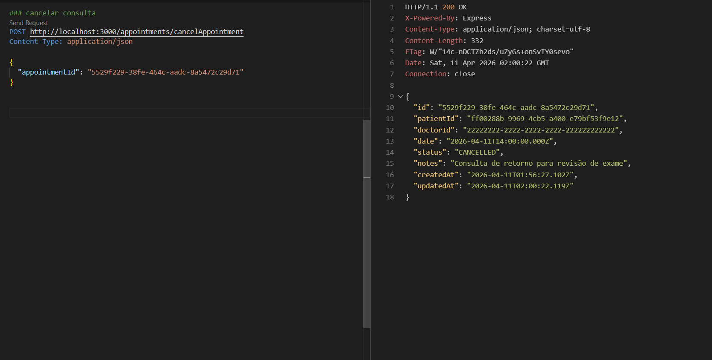
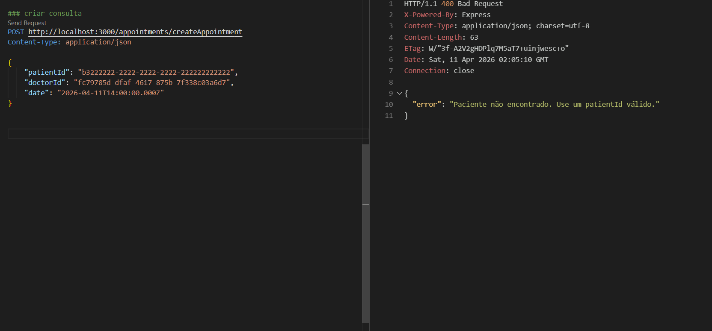

# Documentação dos Endpoints de Appointment

## Visão Geral

Esta documentação descreve os endpoints da API relacionados ao gerenciamento de agendamentos médicos (appointments). Estes endpoints permitem criar, listar e cancelar agendamentos entre pacientes e médicos.

## Endpoints Disponíveis

### 1. Criar Agendamento

**Método:** `POST`  
**URL:** `/createAppointment`  
**Descrição:** Cria um novo agendamento médico.

#### Parâmetros da Requisição

- **Body (JSON):**
  ```json
  {
    "patientId": "string (UUID)",
    "doctorId": "string (UUID)",
    "date": "string (ISO 8601 datetime)",
    "notes": "string (opcional)"
  }
  ```

#### Respostas

- **201 Created:** Agendamento criado com sucesso
  ```json
  {
    "id": "string (UUID)",
    "patientId": "string (UUID)",
    "doctorId": "string (UUID)",
    "date": "string (ISO 8601 datetime)",
    "status": "PENDING",
    "notes": "string (opcional)",
    "createdAt": "string (ISO 8601 datetime)",
    "updatedAt": "string (ISO 8601 datetime)"
  }
  ```

- **400 Bad Request:** Erro de validação ou negócio
  ```json
  {
    "error": "Mensagem de erro"
  }
  ```

<!-- Inserir print da tela de criação de agendamento aqui -->

<!-- Inserir vídeo demonstrando o processo de criação de agendamento aqui -->

### 2. Listar Agendamentos por Usuário

**Método:** `GET`  
**URL:** `/listAppointments`  
**Descrição:** Lista todos os agendamentos de um usuário específico.

#### Parâmetros da Requisição

- **Body (JSON):**
  ```json
  {
    "userId": "string (UUID)"
  }
  ```

#### Respostas

- **200 OK:** Lista de agendamentos retornada com sucesso
  ```json
  [
    {
      "id": "string (UUID)",
      "patientId": "string (UUID)",
      "doctorId": "string (UUID)",
      "date": "string (ISO 8601 datetime)",
      "status": "PENDING | CONFIRMED | CANCELLED | RESCHEDULED",
      "notes": "string (opcional)",
      "createdAt": "string (ISO 8601 datetime)",
      "updatedAt": "string (ISO 8601 datetime)"
    }
  ]
  ```

- **400 Bad Request:** Erro de validação
  ```json
  {
    "error": "Mensagem de erro"
  }
  ```

<!-- Inserir print da tela de listagem de agendamentos aqui -->

<!-- Inserir vídeo demonstrando a navegação pela lista de agendamentos aqui -->

### 3. Cancelar Agendamento

**Método:** `POST`  
**URL:** `/cancelAppointment`  
**Descrição:** Cancela um agendamento existente.

#### Parâmetros da Requisição

- **Body (JSON):**
  ```json
  {
    "appointmentId": "string (UUID)"
  }
  ```

#### Respostas

- **200 OK:** Agendamento cancelado com sucesso
  ```json
  {
    "id": "string (UUID)",
    "patientId": "string (UUID)",
    "doctorId": "string (UUID)",
    "date": "string (ISO 8601 datetime)",
    "status": "CANCELLED",
    "notes": "string (opcional)",
    "createdAt": "string (ISO 8601 datetime)",
    "updatedAt": "string (ISO 8601 datetime)"
  }
  ```

- **400 Bad Request:** Erro de validação ou negócio
  ```json
  {
    "error": "Mensagem de erro"
  }
  ```

---

# Cenários de Teste — API de Appointments

## Contexto

Este documento descreve os cenários de teste para a API de agendamentos (appointments) do MedHub. Cada cenário corresponde a um vídeo de demonstração, cobrindo um comportamento isolado da API.

**Base URL:** `http://localhost:3000/appointments`

**Autenticação:** todos os endpoints exigem o header (se aplicável):
```
Authorization: Bearer <token>
```

## Ferramentas utilizadas

| Ferramenta        | O que é                                           | Por que usamos                                                                                                                                                                                                      |
| ----------------- | ------------------------------------------------- | ------------------------------------------------------------------------------------------------------------------------------------------------------------------------------------------------------------------- |
| **Postman**       | Cliente HTTP para enviar requisições à API        | Permite executar cada cenário de forma isolada e visualizar as respostas com formatação                                                                                                                             |
| **Prisma Studio** | Interface visual para o banco de dados PostgreSQL | Permite verificar as mudanças persistidas no banco após cada operação — por exemplo, confirmar que o status mudou para CANCELLED após cancelar um agendamento                                                  |

### Por que o Prisma Studio é necessário neste contexto

Os endpoints de appointments modificam o banco de dados diretamente. O Prisma Studio permite:

- Verificar a criação de novos registros na tabela Appointment
- Confirmar mudanças de status (PENDING → CANCELLED)
- Inspecionar relacionamentos com User (patient/doctor)

---

## Referência rápida de endpoints

| Método | Rota                 | Descrição                    |
| ------ | -------------------- | ---------------------------- |
| POST   | /createAppointment   | Criar novo agendamento       |
| GET    | /listAppointments    | Listar agendamentos do usuário |
| POST   | /cancelAppointment   | Cancelar agendamento         |

---

## Pré-requisitos

Antes de iniciar os cenários, configure o ambiente com dados de teste:

1. Certifique-se de que o banco está rodando e as migrações aplicadas
2. Use IDs de usuários existentes ou crie manualmente via Prisma Studio
3. Para autenticação, gere tokens JWT se necessário (dependendo da implementação)

**IDs de exemplo para teste:**

- Patient ID: `a1111111-1111-1111-1111-111111111111`
- Doctor ID: `b2222222-2222-2222-2222-222222222222`
- Appointment ID existente: `fc79785d-dfaf-4617-875b-7f338c03a6d7`

---

## Cenários de Teste

### Cenário 1 — Criar agendamento com sucesso

**Rota:** `POST /createAppointment`

**Objetivo:** Demonstrar que a API cria o agendamento no banco e retorna os dados criados.

#### Requisição

```http
POST /appointments/createAppointment HTTP/1.1
Host: localhost:3000
Content-Type: application/json

{
    "patientId": "a1111111-1111-1111-1111-111111111111",
    "doctorId": "b2222222-2222-2222-2222-222222222222",
    "date": "2026-04-10T14:00:00.000Z",
    "notes": "Consulta de retorno para revisão de exame"
}
```

#### Resposta esperada (201)

```json
{
    "id": "uuid-gerado",
    "patientId": "a1111111-1111-1111-1111-111111111111",
    "doctorId": "b2222222-2222-2222-2222-222222222222",
    "date": "2026-04-10T14:00:00.000Z",
    "status": "PENDING",
    "notes": "Consulta de retorno para revisão de exame",
    "createdAt": "2026-04-10T...",
    "updatedAt": "2026-04-10T..."
}
```
#### Print de demonstração


### Cenário 2 — Listar agendamentos por usuário

**Rota:** `GET /listAppointments`

**Objetivo:** Demonstrar que a API retorna a lista de agendamentos do usuário especificado.

#### Requisição

```http
GET /appointments/listAppointments HTTP/1.1
Host: localhost:3000
Content-Type: application/json

{
    "userId": "a1111111-1111-1111-1111-111111111111"
}
```

#### Resposta esperada (200)

```json
[
    {
        "id": "uuid-do-agendamento",
        "patientId": "a1111111-1111-1111-1111-111111111111",
        "doctorId": "b2222222-2222-2222-2222-222222222222",
        "date": "2026-04-10T14:00:00.000Z",
        "status": "PENDING",
        "notes": "Consulta de retorno para revisão de exame",
        "createdAt": "2026-04-10T...",
        "updatedAt": "2026-04-10T..."
    }
]
```

#### Print de demonstração


### Cenário 3 — Cancelar agendamento com sucesso

**Rota:** `POST /cancelAppointment`

**Objetivo:** Demonstrar que a API altera o status do agendamento para CANCELLED.

#### Requisição

```http
POST /appointments/cancelAppointment HTTP/1.1
Host: localhost:3000
Content-Type: application/json

{
    "appointmentId": "fc79785d-dfaf-4617-875b-7f338c03a6d7"
}
```

#### Resposta esperada (200)

```json
{
    "id": "fc79785d-dfaf-4617-875b-7f338c03a6d7",
    "patientId": "a1111111-1111-1111-1111-111111111111",
    "doctorId": "b2222222-2222-2222-2222-222222222222",
    "date": "2026-04-10T14:00:00.000Z",
    "status": "CANCELLED",
    "notes": "Consulta de retorno para revisão de exame",
    "createdAt": "2026-04-10T...",
    "updatedAt": "2026-04-10T..."
}
```

#### Print de demonstração


### Cenário 4 — Erro de validação

**Objetivo:** Demonstrar o tratamento de erros quando parâmetros inválidos são enviados.

#### Requisição (exemplo com UUID inválido)

```http
POST /appointments/createAppointment HTTP/1.1
Host: localhost:3000
Content-Type: application/json

{
    "patientId": "invalid-uuid",
    "doctorId": "b2222222-2222-2222-2222-222222222222",
    "date": "2026-04-10T14:00:00.000Z"
}
```

#### Resposta esperada (400)

```json
{
    "error": [
        {
            "code": "invalid_string",
            "message": "Invalid uuid",
            "path": ["patientId"]
        }
    ]
}
```

#### Print de demonstração
