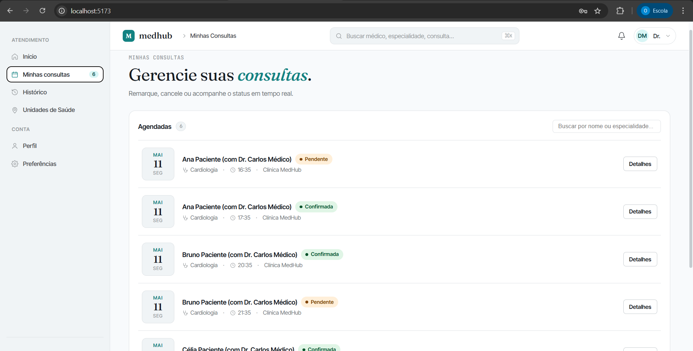
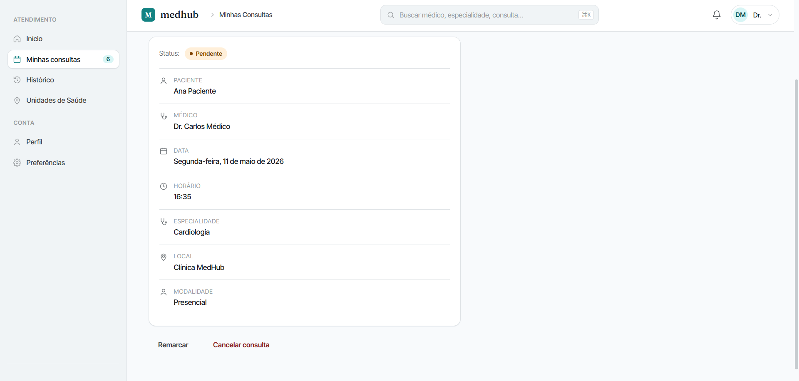
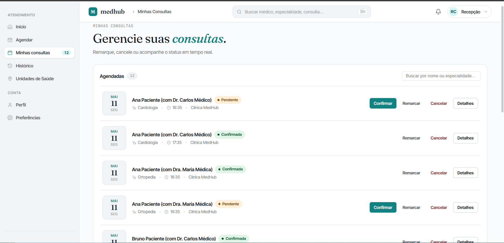
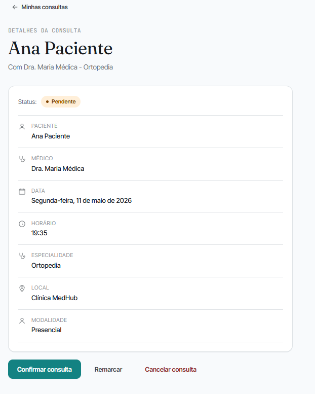

# Cenários de Teste — Gestão de Agendamentos Frontend (RF-002)

## Contexto

Este documento descreve os cenários de teste para a interface web de gestão de agendamentos do MedHub (RF-002). O foco deste requisito é garantir que Médicos e Recepcionistas consigam visualizar e gerenciar as marcações, com permissões e visões diferentes do Paciente.

**Requisito funcional:** RF-002 — O sistema deve permitir que médicos e recepcionistas gerenciem a agenda de marcações através da interface web.

**URL local:** `http://localhost:5173`

**Autenticação:** fazer login como Recepcionista ou Médico antes de iniciar os cenários.

---

## Ferramentas utilizadas

| Ferramenta             | O que é                                          | Por que usamos                                                                                                              |
| ---------------------- | ------------------------------------------------ | --------------------------------------------------------------------------------------------------------------------------- |
| **Navegador**          | Chrome ou Firefox                                | Executar a aplicação e capturar os cenários                                                                                 |
| **Mock Server**        | Servidor Express local (`mock-server/server.js`) | Substitui o backend real em desenvolvimento — serve as consultas simuladas e lida com mudança de status.                    |

---

## Pré-requisitos

1. Instalar dependências em `src/web/`: `npm install`
2. Iniciar o mock server: `node mock-server/server.js` (porta 3001)
3. Iniciar o frontend: `npm run dev` (porta 5173)

---

## Seção 1 — Visão do Médico

Cenários que garantem a correta exibição e limitação de funcionalidades para o cargo `DOCTOR`.

---

### Cenário 1 — Médico visualizando sua agenda sem poder criar agendamentos
**RF-002:** Gestão da agenda via interface (Visão Médico)

**Componente:** `HomeView` e `AppointmentsView`

**Objetivo:** Demonstrar que a interface se adapta para o Médico, escondendo os atalhos de agendamento e exibindo o nome dos pacientes corretamente nas listas de consultas pendentes.

**Pré-condição:** Autenticado como Médico (`role: DOCTOR`).

**Passos:**
1. Acessar a tela inicial (`/`) do sistema.
2. Observar a ausência do botão "Agendar Consulta" no menu lateral e dos cards de atalho rápido.
3. Observar a seção "Próximas consultas" e ler o nome exibido nos cartões.
4. Clicar em "Consultas" no menu lateral.
5. Clicar em "Detalhes" de uma consulta e verificar se as ações exibidas incluem cancelar, mas não editar livremente (dependendo da regra local).

**Resultado esperado:**
- A UI remove atalhos de "Novo agendamento".
- O campo que antes mostrava o médico (para o paciente) agora mostra o `patientName` para o médico (ex: "Ana Beatriz").

---

## Seção 2 — Visão da Recepção

Cenários que atestam os privilégios totais da `RECEPTIONIST`.

---

### Cenário 2 — Recepção criando um agendamento para terceiro
**RF-002:** Gestão da agenda via interface (Visão Recepção)

**Componente:** `ScheduleView`

**Objetivo:** Demonstrar que a recepção possui um fluxo adaptado que permite burlar travas de antecedência e confirmar agendamentos.

**Pré-condição:** Autenticado como Recepcionista (`role: RECEPTIONIST`).

**Passos:**
1. Clicar em "Agendar" no menu lateral.
2. Selecionar o paciente no novo "Passo 1".
3. Prosseguir até a seleção de horário.
4. Escolher um horário muito próximo (menos de 4 horas de antecedência).
5. Finalizar agendamento.

**Resultado esperado:**
- A recepcionista navega sem bloqueios pela interface.
- A trava de 4 horas é ignorada para este perfil.

