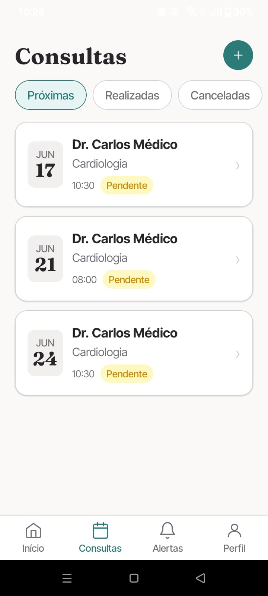
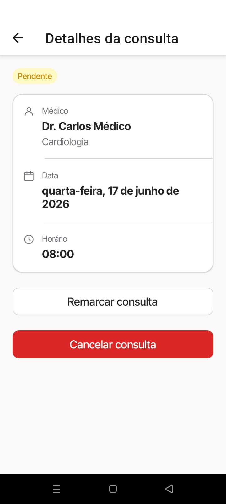
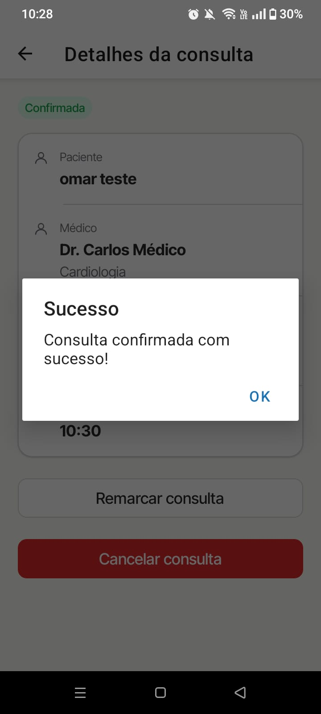
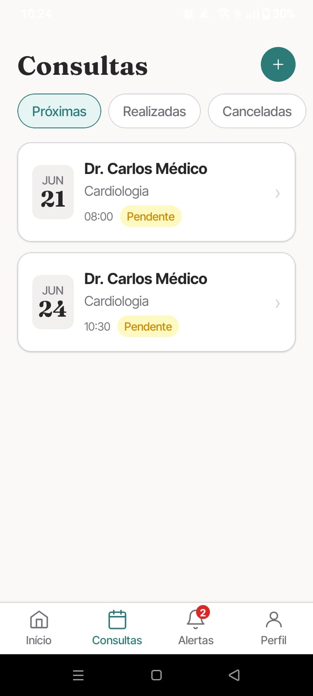
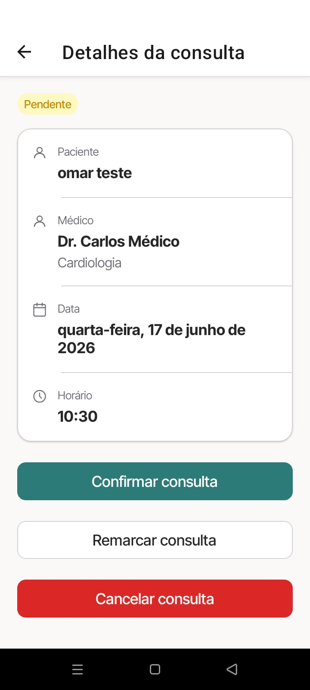

# Cenários de Teste — Gestão de Agendamentos Mobile (RF-002)

## Contexto

Este documento descreve os cenários de teste para a interface de gestão de agendamentos do MedHub, implementada no RF-002. Cada cenário cobre um comportamento visual isolado, com passos numerados e resultado esperado para demonstração em print.

**Requisito funcional:** RF-002 — O sistema deve permitir que médicos e recepcionistas gerenciem a agenda de marcações através da interface mobile.

**Plataforma:** React Native (Expo) — testado em dispositivo físico ou emulador Android/iOS.

**Autenticação:** fazer login como Recepcionista ou Médico antes de iniciar os cenários.

---

## Ferramentas utilizadas

| Ferramenta   | O que é                                    | Por que usamos                                                                 |
| ------------ | ------------------------------------------ | ------------------------------------------------------------------------------ |
| **Expo Go**     | App para executar projetos Expo em dispositivo | Executar a aplicação mobile e capturar os cenários.                           |
| **Mock Server** | Servidor Express local (`mock-server/server.js`) | Substitui o backend real em desenvolvimento, servindo as consultas simuladas. |

---

## Pré‑requisitos

1. Instalar dependências em `src/mobile/`: `npm install`
2. Iniciar o mock server: `node mock-server/server.js` (porta 3001)
3. Iniciar a aplicação mobile: `npx expo start`
4. Abrir no Expo Go no dispositivo físico ou emulador

---

## Seção 1 — Visão do Médico

### Cenário 1 — Médico visualizando sua agenda e os detalhes da consulta

**RF‑002:** Gestão da agenda via interface (Visão Médico)

**Componente:** `HomeView` e `AppointmentsView`

**Objetivo:** Demonstrar que a interface mostra as consultas agendadas e, nos detalhes, exibe o paciente e as ações permitidas para o perfil médico.

**Pré‑condição:** Autenticado como Médico (`role: DOCTOR`).

**Passos:**
1. Acessar a tela inicial (`/`) do aplicativo
2. Observar o atalho "Agendar agora" e a seção "Próximas consultas"
3. Clicar em "Consultas" na barra inferior
4. Abrir os detalhes de uma consulta
5. Verificar a exibição do paciente e as ações disponíveis

**Resultado esperado:**
- A tela inicial exibe o atalho "Agendar agora" e os cards de próximas consultas
- A listagem de consultas mostra médico, especialidade e status
- Nos detalhes, o paciente é exibido para o perfil médico e as ações de confirmar, cancelar e reagendar ficam restritas ao perfil correspondente

---

## Seção 2 — Visão da Recepção

### Cenário 2 — Recepção criando um novo agendamento

**RF‑002:** Gestão da agenda via interface (Visão Recepção)

**Componente:** `ScheduleView`

**Objetivo:** Demonstrar que a recepção inicia o fluxo pela seleção de paciente e conclui o agendamento na interface mobile.

**Pré‑condição:** Autenticado como Recepcionista (`role: RECEPTIONIST`).

**Passos:**
1. Clicar em "Agendar agora" na tela inicial ou em "Nova consulta" na barra inferior
2. Selecionar um paciente na listagem do "Passo 1"
3. Prosseguir até a etapa de seleção de médico, data e horário
4. Escolher um horário disponível no calendário e na lista de slots
5. Clicar em "Confirmar agendamento"

**Resultado esperado:**
- O fluxo permite a busca e escolha de pacientes válidos
- A criação avança pelas etapas de paciente, médico, data, horário e revisão
- A consulta é registrada com sucesso após a confirmação

