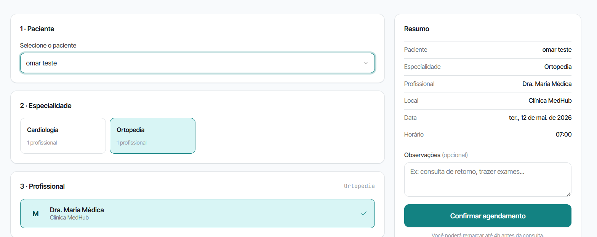

# Cenários de Teste — Segurança de Agendamentos Frontend (RF-003)

## Contexto

Este documento descreve os cenários de teste para a interface web de validação de perfis do MedHub, implementada no RF-003. Cada cenário cobre um comportamento visual isolado, com passos numerados e resultado esperado para demonstração em print.

**Requisito funcional:** RF-003 — O sistema deve impedir o agendamento de consultas sem que o perfil do usuário esteja devidamente cadastrado e validado.

**URL local:** `http://localhost:5173`

**Autenticação:** fazer login como Recepcionista.

---

## Ferramentas utilizadas

| Ferramenta             | O que é                                          | Por que usamos                                                                                                              |
| ---------------------- | ------------------------------------------------ | --------------------------------------------------------------------------------------------------------------------------- |
| **Navegador**          | Chrome ou Firefox                                | Executar a aplicação e capturar os cenários                                                                                 |
| **Mock Server**        | Servidor Express local (`mock-server/server.js`) | Fornece os perfis validados de pacientes para a interface.                                                                  |

---

## Pré-requisitos

1. Iniciar o mock server: `node mock-server/server.js` (porta 3001)
2. Iniciar o frontend: `npm run dev` (porta 5173)

---

## Seção 1 — Seleção Segura na Recepção

---

### Cenário 1 — Agendamento atrelado a um perfil existente

**RF-003:** Impedir agendamento de consultas sem perfil validado

**Componente:** `ScheduleView`

**Objetivo:** Demonstrar que o formulário obriga a seleção de um paciente validado (cadastrado no banco de dados) antes de prosseguir com o agendamento.

**Pré-condição:** Autenticado como Recepção (`role: RECEPTIONIST`).

**Passos:**
1. Clicar em "Agendar" no menu lateral
2. Observar a tela do "Passo 1: Paciente"
3. Tentar pular esta etapa sem selecionar um usuário (observar bloqueio)
4. Clicar na caixa de seleção e verificar a lista de pacientes
5. Selecionar um paciente válido e prosseguir com o fluxo

**Resultado esperado:**
- O botão "Confirmar agendamento" fica desabilitado ou invisível sem um paciente selecionado
- A listagem apresenta apenas usuários legítimos do banco (perfis validados), evitando cadastros avulsos ou CPFs não atrelados à conta

**Mídia:**

