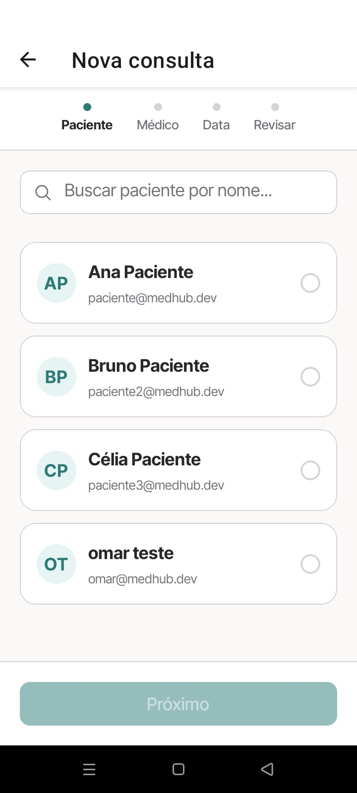

# Cenários de Teste — Segurança de Agendamentos Mobile (RF-003)

## Contexto

Este documento descreve os cenários de teste para a interface mobile de agendamento do MedHub, implementada no RF-003. Cada cenário cobre um comportamento visual isolado, com passos numerados e resultado esperado para demonstração em print.

**Requisito funcional:** RF-003 — O sistema deve impedir o agendamento de consultas sem que o paciente seja selecionado corretamente no fluxo de criação.

**Plataforma:** React Native (Expo) — testado em dispositivo físico ou emulador Android/iOS.

**Autenticação:** fazer login como Recepcionista.

---

## Ferramentas utilizadas

| Ferramenta             | O que é                                          | Por que usamos                                                                                                              |
| ---------------------- | ------------------------------------------------ | --------------------------------------------------------------------------------------------------------------------------- |
| **Expo Go**            | App para executar projetos Expo                  | Executar o app e capturar os cenários no contexto mobile.                                                                   |
| **Mock Server**        | Servidor Express local (`mock-server/server.js`) | Fornece os perfis validados de pacientes para a interface do aplicativo.                                                    |

---

## Pré-requisitos

1. Iniciar o mock server: `node mock-server/server.js` (porta 3001)
2. Iniciar a aplicação mobile: `npx expo start`
3. Abrir no Expo Go no dispositivo físico ou emulador

## Seção 1 — Seleção Segura na Recepção

### Cenário 1 — Seleção obrigatória de paciente no agendamento

**RF-003:** Exigir seleção de paciente no agendamento

**Componente:** `ScheduleView`

**Objetivo:** Demonstrar que o fluxo de agendamento exige a seleção de um paciente antes de avançar para as etapas seguintes.

**Pré-condição:** Autenticado no app como Recepção (`role: RECEPTIONIST`).

**Passos:**
1. Abrir "Agendar agora" na tela inicial ou "Nova consulta" na barra inferior
2. Observar a tela do "Passo 1" com a seleção de paciente
3. Tentar avançar sem selecionar um paciente
4. Tocar no campo de busca e verificar a lista de pacientes
5. Selecionar um paciente e prosseguir com o fluxo

**Resultado esperado:**
- O botão "Próximo" fica desabilitado até que um paciente seja selecionado
- A lista de pacientes vem da API e permite avançar apenas após uma escolha válida

