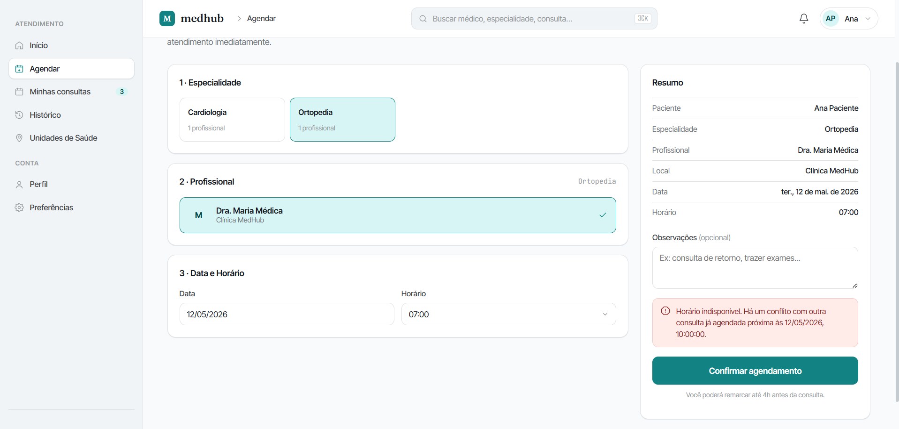

# Cenários de Teste — Conflito de Horários Frontend (RF-004)

## Contexto

Este documento descreve os cenários de teste para a interface web na gestão de concorrência do MedHub, implementada no RF-004. Cada cenário cobre um comportamento visual isolado, com passos numerados e resultado esperado para demonstração em print.

**Requisito funcional:** RF-004 — O sistema deve impedir o agendamento de mais de uma consulta para o mesmo médico no mesmo horário.

**URL local:** `http://localhost:5173`

**Autenticação:** fazer login como Paciente ou Recepção.

---

## Ferramentas utilizadas

| Ferramenta             | O que é                                          | Por que usamos                                                                                                              |
| ---------------------- | ------------------------------------------------ | --------------------------------------------------------------------------------------------------------------------------- |
| **Navegador**          | Chrome ou Firefox                                | Executar a aplicação e capturar os cenários                                                                                 |
| **Mock Server**        | Servidor Express local (`mock-server/server.js`) | Rejeita requisições (HTTP 400) simulando a falha de constraint única que aconteceria no banco de dados real.                |

---

## Pré-requisitos

1. Iniciar o mock server: `node mock-server/server.js` (porta 3001)
2. Iniciar o frontend: `npm run dev` (porta 5173)
3. Garantir a existência de uma consulta marcada para podermos forçar a colisão (Ex: Consulta para hoje, 14:00).

---

## Seção 1 — Concorrência na Interface

---

### Cenário 1 — Tentar agendar no mesmo horário de consulta já existente

**RF-004:** Impedir mais de uma consulta para mesmo médico e horário

**Componente:** `ScheduleView`

**Objetivo:** Demonstrar o comportamento visual da interface quando a API rejeita uma tentativa de agendamento duplo.

**Pré-condição:** Autenticado. Consulta já registrada previamente.

**Passos:**
1. Acessar "Agendar" no menu lateral
2. Selecionar o mesmo médico da consulta pré-existente
3. Selecionar a mesma data
4. Escolher exatamente o mesmo horário da consulta já alocada
5. Clicar em "Confirmar agendamento"

**Resultado esperado:**
- A aplicação submete os dados, mas a API retorna Status 400
- A tela de carregamento é encerrada
- Uma notificação ou banner de erro exibe a mensagem informando que o horário está indisponível
- O formulário é mantido na tela para que o usuário escolha um novo horário sem perder o progresso

**Mídia:**

