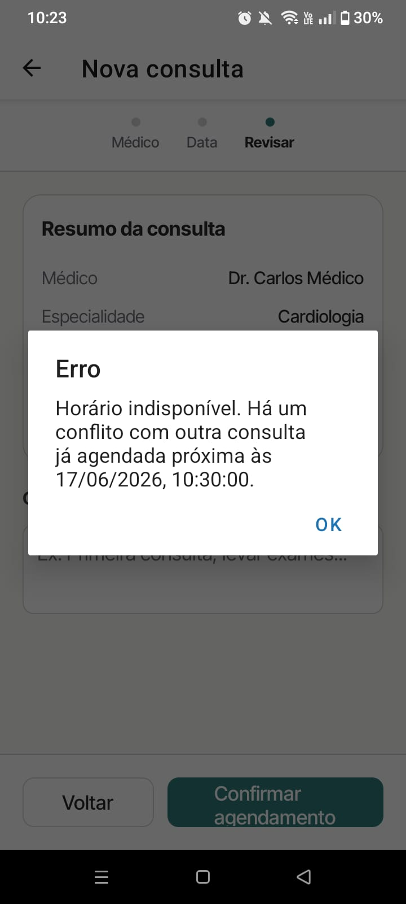

# Cenários de Teste — Conflito de Horários Mobile (RF-004)

## Contexto

Este documento descreve os cenários de teste para a interface mobile na gestão de concorrência do MedHub, implementada no RF-004. Cada cenário cobre um comportamento visual isolado, com passos numerados e resultado esperado para demonstração em print.

**Requisito funcional:** RF-004 — O sistema deve impedir o agendamento de mais de uma consulta para o mesmo médico no mesmo horário.

**Plataforma:** React Native (Expo) — testado em dispositivo físico ou emulador Android/iOS.

**Autenticação:** fazer login como Paciente ou Recepção.

---

## Ferramentas utilizadas

| Ferramenta             | O que é                                          | Por que usamos                                                                                                              |
| ---------------------- | ------------------------------------------------ | --------------------------------------------------------------------------------------------------------------------------- |
| **Expo Go**            | App para executar projetos Expo                  | Executar o app e capturar os cenários no contexto mobile.                                                                   |
| **Mock Server**        | Servidor Express local (`mock-server/server.js`) | Rejeita requisições simulando a falha de constraint única que aconteceria no banco de dados real.                           |

---

## Pré-requisitos

1. Iniciar o mock server: `node mock-server/server.js` (porta 3001)
2. Iniciar a aplicação mobile: `npx expo start`
3. Garantir a existência de uma consulta marcada para podermos forçar a colisão (ex.: consulta para hoje, 14:00)

---

## Seção 1 — Concorrência na Interface Mobile

### Cenário 1 — Tentar agendar no mesmo horário de consulta já existente

**RF-004:** Impedir mais de uma consulta para mesmo médico e horário

**Componente:** `ScheduleView`

**Objetivo:** Demonstrar o comportamento visual da interface mobile quando a API rejeita uma tentativa de agendamento em horário já ocupado.

**Pré-condição:** Autenticado no app. Consulta já registrada previamente no sistema.

**Passos:**
1. Abrir "Agendar agora" na tela inicial ou "Nova consulta" na barra inferior
2. Selecionar o mesmo médico da consulta pré-existente
3. Selecionar a mesma data no calendário do app
4. Escolher exatamente o mesmo horário da consulta já alocada
5. Tocar em "Confirmar agendamento"

**Resultado esperado:**
- O app envia os dados, mas a API retorna status de erro (ex.: 400 ou 409)
- A tela de loading do botão é encerrada
- Um alerta nativo exibe a mensagem informando que o horário está indisponível
- O usuário permanece na mesma tela para escolher outro horário sem perder o preenchimento atual

