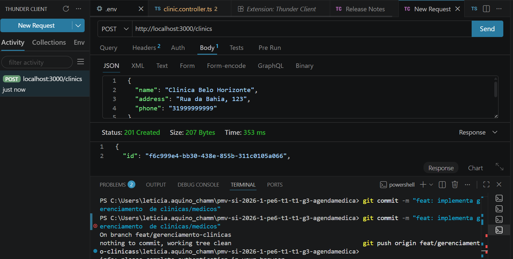
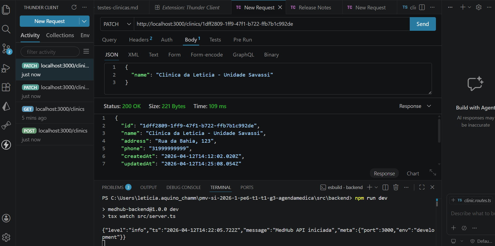

# Cenários de Teste - Módulo de Clínicas

Este documento descreve os testes realizados para validar o gerenciamento de clínicas.

Execução de requisição POST via Thunder Client para o endpoint /clinics. Uma imagem demonstra o envio do payload JSON (topo) e a resposta do servidor com o Status HTTP 201 (Created), confirmando a persistência dos dados no banco PostgreSQL e a geração automática do UUID para a nova clínica.

## 1. Cadastro de Nova Clínica
**Objetivo:** Verificar se o sistema permite a criação de uma clínica com dados válidos.
- **Tipo de Teste:** Integração / API
- **Método:** `POST`
- **URL:** `http://localhost:3000/clinics`
- **Payload Enviado:**
  ```json
  {
    "name": "Clinica Belo Horizonte",
    "address": "Rua da Bahia, 123",
    "phone": "31999999999"
  }
  Resultado Esperado: Status 201 Created e retorno do objeto com ID gerado.

Resultado Obtido: Sucesso (Status 201).

## 2. Listagem de Clínicas
Objetivo: Validar se a API retorna a lista de clínicas cadastradas no banco.

Método: GET

URL: http://localhost:3000/clinics

Resultado Esperado: Status 200 OK e um array de objetos.

Resultado Obtido: Sucesso.

## Evidências (Prints)
O teste foi realizado utilizando a extensão Thunder Client no VS Code.
Nota: Os prints de execução foram anexados ao Pull Request #39 para conferência do grupo.
 



